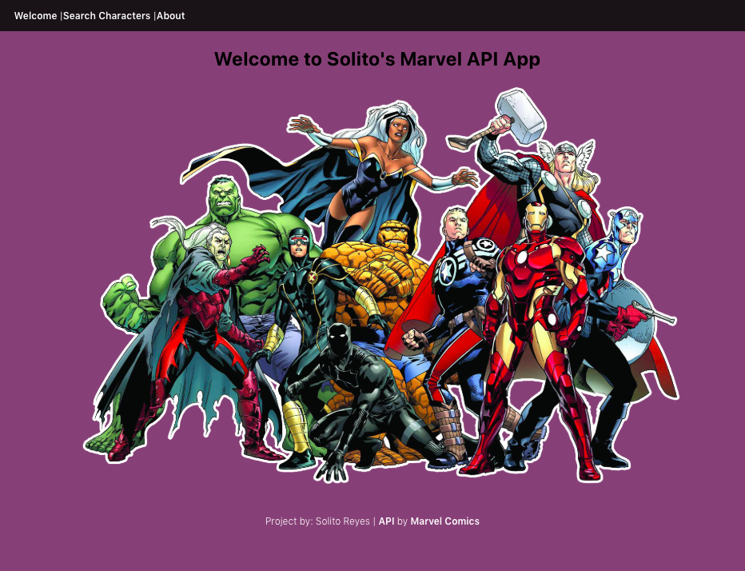
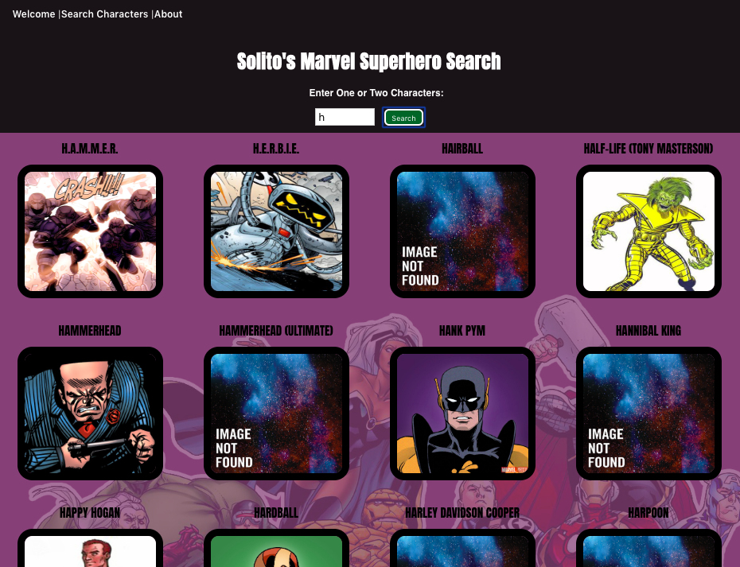
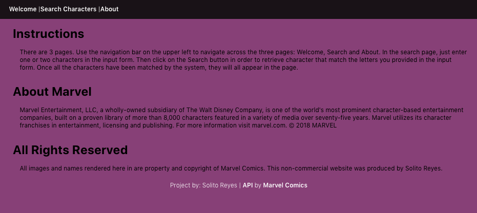
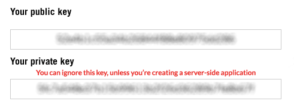
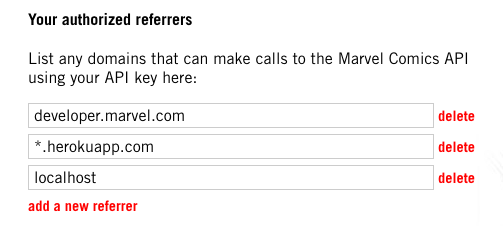

# Marvel Comics Character Search App
## React API App
Welcome to my first React App. I wrote this in HTML, CSS Flex, and Javascript using React.js framework. I really enjoyed working on this project.  

## Description
This React App uses fetch to pull information from the Marvel Comics API and renders that information to an output page. Marvel provides fun and colorful imagery for developers to utilize.

## How This Works
1. Go to this URL: https://ancient-shelf-14355.herokuapp.com
2. You'll arrive at the welcome screen 
    * In the navigation bar, click on Search Characters  
3. In the Search Characters page, you will see a search box and submit button.
    * Enter one or two letters of the alphabet into the search box.
    * Click on the search button provided next to the box.
4. You will now see a display of characters that match the strings you've entered in the search.

# Screenshots:
## Wire Frame


## Welcome


## Search Characters


## About


# Programming
## Code Snippet Sample:
The React component code below sets the initial state for the search's input box, provides a capture array for the API data, fetches the data from the API, sets controls for the submitting the input values, and selects the defined fields from the API to be rendered.

```
import React, { Component } from 'react';
import Nav from './Nav';
import HeroList from './HeroList';
import './header.css';


export default class Header extends Component {
  state = {
    name: 'h',
    apiData: []
  }

handleSubmit(e) {
  e.preventDefault()
  this.getApi()
}

handleChange(e) {
  const {name, value} = e.target;
  this.setState({
     [name]: value
   })
 }

 getApi() {
  fetch(`https://gateway.marvel.com:443/v1/public/characters?nameStartsWith=${this.state.name}&apikey=********************`)
  .then(response => {
    return response.json();
  })
  .then((json) => {
    this.setState({
      apiData: json.data.results
    })
  })
}

  render() {
    return (
      <div>
        <header className="headerStyle">
        <h1>Solito's Marvel Superhero Search</h1>   
        <form className="searchForm" onSubmit={(e) => this.handleSubmit(e)}>
          <p className="inputInstructs">Enter One or Two Characters:</p>
          <input className="inputFieldBox" type='text' placeholder='ex: "h..."' value={this.state.name} name='name' onChange={(e) => this.handleChange(e)}/>
          <button className="inputButton" type='submit'>Search</button>
        </form>
      </header>
        <HeroList heroes = {this.state.apiData} />
      </div>
    )
  }
}

```
## Irrelevent Private Key
When you request a key, you will receive two: 
1. Public key
2. Private key

Just ignore this Private key altogether when making a fetch call in your app. It's completely extraneous unless you are building a server-side application.



## Add Domain in Referrer
Enter the app's domain name into the referrer security form in your Marvel Developer account. Failing to enter a correct domain, will give you a 401 error when trying to fetch data. You may also see misleading programming errors in console log about your fetch code potentially leading you into a wild goose chase. For your React app add 'localhost' without the quotes. After deployment, add the URL provided by your host provider, such your 'Herokuapp.com'. See image below.



# User Story
A user who wanted to see a realm of Marvel characters, can do so by using this App. Most people are familiar with the most popular characters, like The Hulk or Wolverine, but they may not be familiar with characters like Danny Rand or Genesis. This is a great tool for discovering those other obscure characters in Marvel Universe. However, not all characters are provided. For example, One About All does not appear in this API.


